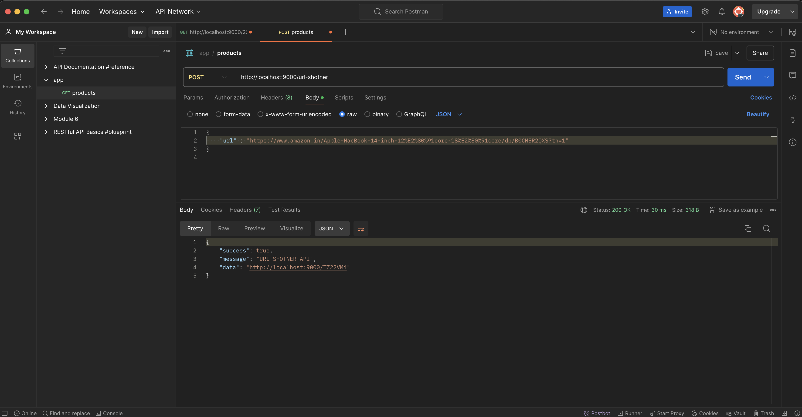

# URL Shortener Application

A simple URL shortener application built with Node.js and Express, which allows users to shorten long URLs into shorter, easily shareable links.

## Screenshort



## Features

- `Shorten URLs`: Convert long URLs into short, easily shareable links.
- `Redirect`: Redirects short URLs to their corresponding long URLs.
- `Validation`: Validates URLs to ensure they are properly formatted.
- `Persistence`: Stores the mappings between short and long URLs in a JSON file.

## Getting Started

Follow these instructions to set up and run the project on your local machine.

### Installation

1. Clone the repository:
```sh
git clone https://github.com/Lovenoelkujur/url-shortner-application.git
cd url-shortener
```
2. Install dependencies:
```sh
npm install
```

### Running the Application

1. Start the server:

```
npm start
```

The application will run on `http://localhost:9000`.

## API Endpoints

1. ### Shorten URL
- `Endpoint`: /url-shortener

- `Method`: POST

- `Request Body`:
```json
{
    "url": "https://www.example.com"
}
```
- Response:
```json
{
    "success": true,
    "message": "URL SHORTENER API",
    "data": "http://localhost:9000/shortUrl"
}
```

- `shortUrl`: The generated short URL.

2. ### Redirect to Long URL

- Endpoint: `/:shortUrl`

- Method: `GET`

Redirects to the original long URL corresponding to the given short URL

3. ### Handle Invalid Paths

- Endpoint: `/*`

- Method: `GET`

Responds with a 404 status and an error message for invalid paths

## Example Usage

1. Shorten a URL

```sh
curl -X POST http://localhost:9000/url-shortener -H "Content-Type: application/json" -d '{"url": "https://www.example.com"}'
```

Response

    ```json
    {
        "success": true,
        "message": "URL SHORTENER API",
        "data": "http://localhost:9000/abc1234"
    }
    ```

2. Redirect using a short URL:

Visit `http://localhost:9000/abc1234` in your browser. It should redirect to` https://www.example.com`.

## Notes

- Ensure the `urlmap.json` file is in the same directory as your server file and is writable.
The application does not currently handle concurrent writes to the `urlmap.json` file, which may be an issue in a high-traffic environment.

## Contributing

Contributions are welcome! Please open an issue or submit a pull request for any bugs or feature requests.

## License
This project is licensed under the MIT License